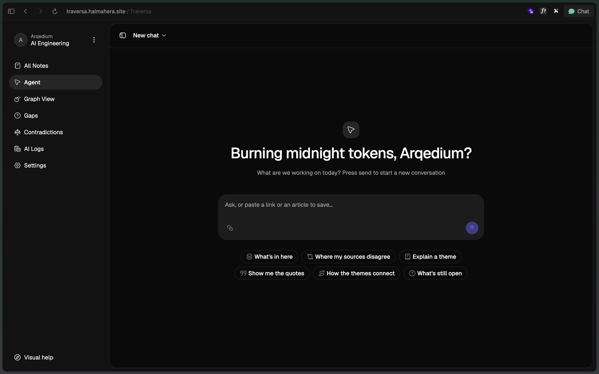
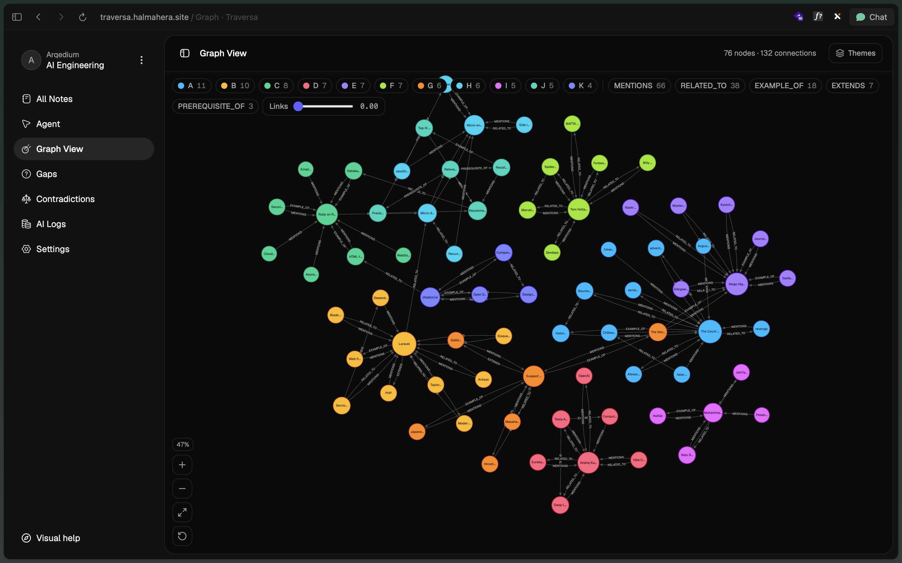

# Traversa

Traversa compiles saved reading into a self-organizing wiki, an evidence-linked
topic graph, and a memory an agent can use without searching the full corpus for
every question.

Save a passage, URL, clipped article, or PDF. A fixed agent workflow extracts its
claims, finds the closest existing page, creates or updates that page, records
conflicts, and adds typed graph links. Every claim keeps the source quote that
supports it.

**Live app:** [traversa.halmahera.site](https://traversa.halmahera.site)

<!-- Add the YouTube demo link here before submission. -->

| Copilot | Topic graph |
| --- | --- |
|  |  |

## Judge walkthrough

The shortest path through the project is:

1. Register and create a workspace.
2. Save two sources about the same subject. The second save should update the
   first wiki page instead of creating a duplicate.
3. Open the compile feed to inspect the page diff, claims, and graph links.
4. Save a source that disputes an existing claim, then open **Contradictions** to
   compare both source quotes.
5. Ask the copilot what the workspace covers. The answer shows whether it used
   compiled memory or fetched a source quote.
6. Open **Graph** to inspect typed links and named topic clusters.

The seed script provides 18 sources across three topic groups, including a
deliberate contradiction. See [Run locally](#run-locally) for the command.

## Why CockroachDB is part of the design

CockroachDB is not only the store behind a retrieval demo. It is the durable
memory that the compile workflow changes on every save.

| Use | Role in Traversa | Code |
| --- | --- | --- |
| Native `VECTOR(1024)` columns | Store source and compiled-page embeddings with the rest of the application data | [`app.prisma`](packages/db/prisma/schema/app.prisma) |
| Cosine vector indexes | Find the nearest compiled pages before the agent decides to create or merge | [`matching.py`](apps/api/app/services/matching.py), [migration](packages/db/prisma/migrations/20260801000000_init/migration.sql) |
| Transactions | Apply a page revision, claims, provenance, graph changes, and run state as one write | [`compile.py`](apps/api/app/services/compile.py) |
| Revision and provenance tables | Keep old page versions, verbatim source quotes, and disputed claims | [`app.prisma`](packages/db/prisma/schema/app.prisma) |
| Operational tooling | Select a Cloud cluster, manage access, apply migrations, and inspect backups; machine-read values use JSON output | [`ccloud.mjs`](scripts/ccloud.mjs) |

The key vector query runs on the write path:

```sql
SELECT id, title,
       1 - (embedding <=> CAST(:query_vector AS VECTOR(1024))) AS similarity
FROM wiki_pages
WHERE workspace_id = :workspace_id
ORDER BY embedding <=> CAST(:query_vector AS VECTOR(1024))
LIMIT :limit;
```

This query decides where new knowledge belongs. The result is then compiled once
into a page. Later questions start from page summaries and graph themes already
stored in CockroachDB. Vector retrieval remains available when the copilot needs
an exact quote.

This keeps structured data, vectors, revisions, and provenance in one database.
There is no separate vector store to synchronize.

## Agent memory model

```text
capture
   |
   v
extract claims and verbatim quotes       Amazon Bedrock, GLM-5
   |
   v
embed and find nearby pages              Bedrock Cohere Embed v4
   |                                     + CockroachDB vector index
   v
create, merge, or add an addendum         Amazon Bedrock, GLM-5
   |
   v
record typed links and knowledge gaps     Amazon Bedrock, GLM-5
   |
   v
commit revision, claims, sources,
graph changes, and compile diff            CockroachDB transaction
```

The workflow order is fixed: `extract -> match -> compile -> link -> persist ->
name clusters`. The model supplies judgment inside a step, but it cannot skip or
reorder steps. Agent outputs are checked with Zod before data is written.
See [`compile-item.ts`](apps/agent/src/mastra/workflows/compile-item.ts).

## Product features

| Surface | What it proves |
| --- | --- |
| Capture | Paste text, save a URL, upload a PDF, or use the Manifest V3 browser extension |
| Compile feed | Shows each workflow step and the resulting structured diff |
| Wiki | Combines related sources into versioned pages with claim-level quotes |
| Contradictions | Keeps both sides of a disputed claim instead of silently choosing one |
| Copilot | Starts with compiled workspace memory and retrieves when it needs source evidence or an omitted page |
| Graph | Shows `extends`, `contradicts`, `prerequisite_of`, and `example_of` links |
| Gaps | Lists prerequisites found by the compiler but not covered by saved material |
| AI logs | Records model, tokens, latency, status, and optional estimated cost per call |

## Architecture

```text
Next.js web app :3000                 Chrome extension
          |                                  |
          +----------------+-----------------+
                           |
                           v
                    FastAPI :8000
             auth, capture, data, SSE events
                    |              |
                    |              +--------> CockroachDB
                    v                         wiki, claims, graph,
               Redis + arq                   revisions, vectors
                    |
                    v
               Mastra :4111
             compile workflow and copilot
                    |
                    v
              Amazon Bedrock
              GLM-5 + Cohere Embed v4
```

The API is the only database writer. The Mastra service reads and writes through
internal API routes. A failed model call therefore cannot leave a partly applied
compile in the database.

## Run locally

### Requirements

- Node.js 22.13 or newer
- pnpm 9.5
- Python 3.11 or newer
- [uv](https://docs.astral.sh/uv/)
- Docker
- An Amazon Bedrock API key with access to `zai.glm-5` and Cohere Embed v4

### Setup

```bash
cp .env.example .env
```

Set these values in `.env`:

```dotenv
OPENAI_API_KEY="your-bedrock-api-key"
BETTER_AUTH_SECRET="a-random-secret-with-at-least-32-characters"
```

The default Bedrock endpoint is Jakarta. If your models are enabled in another
region, also change `OPENAI_BASE_URL` and the related model settings documented
in [`.env.example`](.env.example).

Install dependencies, start local CockroachDB and Redis, apply migrations, and
sync the Python environment:

```bash
pnpm setup
```

Start the web app, API, queue worker, and agent:

```bash
pnpm dev
```

| Service | URL |
| --- | --- |
| Web app | http://localhost:3000 |
| API docs | http://localhost:8000/docs |
| Mastra Studio | http://localhost:4111 |
| CockroachDB Console | http://localhost:8080 |

`pnpm dev` does not start Docker services. After the first setup, run `pnpm
db:up` before `pnpm dev` if the database and Redis containers are stopped.

### Load judge data

Register in the web app first. Then seed the first workspace:

```bash
SEED_EMAIL=judge@example.com SEED_PASSWORD='your-password' pnpm seed
```

You can avoid putting a password in shell history. While signed in, copy the
token from `http://localhost:3000/api/auth/token`, then run:

```bash
SEED_TOKEN='your-token' pnpm seed
```

Seeding is safe to repeat. Content hashes prevent duplicate compiles inside a
workspace.

## CockroachDB Cloud tools

The `pnpm ccloud` wrapper uses `ccloud -o json` for values that the script must
read, such as cluster names and connection URLs. It refuses to guess when an
account has more than one cluster.

```bash
pnpm ccloud status [cluster]
pnpm ccloud url [cluster]
pnpm ccloud use [cluster]
pnpm ccloud allowlist [cluster]
pnpm ccloud migrate [cluster]
pnpm ccloud backups [cluster]
pnpm ccloud audit [days]
```

Run `pnpm ccloud` to print command help. The wrapper preserves the Cloud cluster
route in connection URLs and points migrations at this project's
`knowledge_base` database.

To use the CockroachDB Cloud MCP server, copy [`.mcp.json.example`](.mcp.json.example)
to the config file supported by your MCP client and replace the sample service
account key. Do not commit that key.

The repository also includes four project-specific CockroachDB agent skills in
[`skills/`](skills/). They cover failures found while building this project:

- keeping Prisma migrations inside a dedicated CockroachDB schema;
- preserving vector indexes that Prisma cannot express;
- placing vector search on the memory write path; and
- handling CockroachDB's widened `SUM` result type.

## Database migrations

All application tables use the `kc` schema. Do not run bare `prisma migrate dev`.
Prisma cannot model CockroachDB vector indexes and can emit a `DROP INDEX` for
them during drift checks.

Use the repository commands instead:

```bash
pnpm db:migrate:new <name>
pnpm db:migrate
```

The migration script removes generated vector-index drops and applies migrations
with `prisma migrate deploy`.

## Tests

Run the full suite:

```bash
pnpm test
```

Run one part:

```bash
pnpm test:ts       # client and agent Vitest suites
pnpm test:scripts  # Node tests for scripts and the extension
pnpm api:test      # FastAPI and service tests
```

Other useful checks:

```bash
pnpm check-types
pnpm build
pnpm check:secrets
```

## Repository map

```text
apps/client/       Next.js product UI and Better Auth routes
apps/api/          FastAPI data layer, embeddings, queue worker, and SSE
apps/agent/        Mastra compile workflow and copilot
apps/extension/    Manifest V3 web clipper
packages/db/       Prisma schema, generated client, and migrations
packages/auth/     Better Auth configuration
packages/env/      Shared environment validation
packages/ui/       Shared UI components
packages/contracts Shared Zod contracts
scripts/           Local database, migration, ccloud, and safety scripts
skills/            Project-specific CockroachDB agent skills
```

Last reviewed: 2026-08-19.
